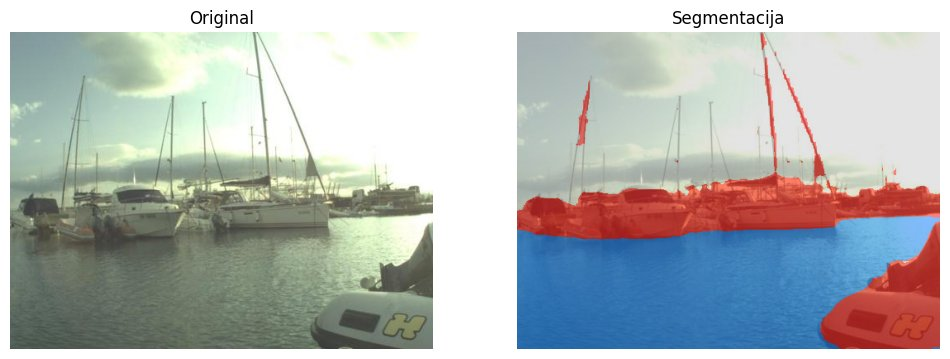
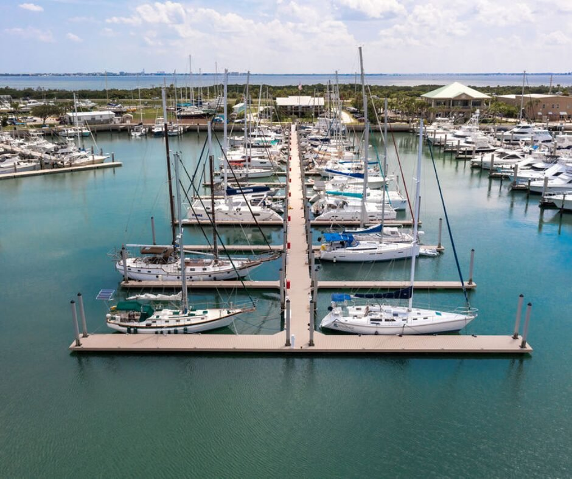
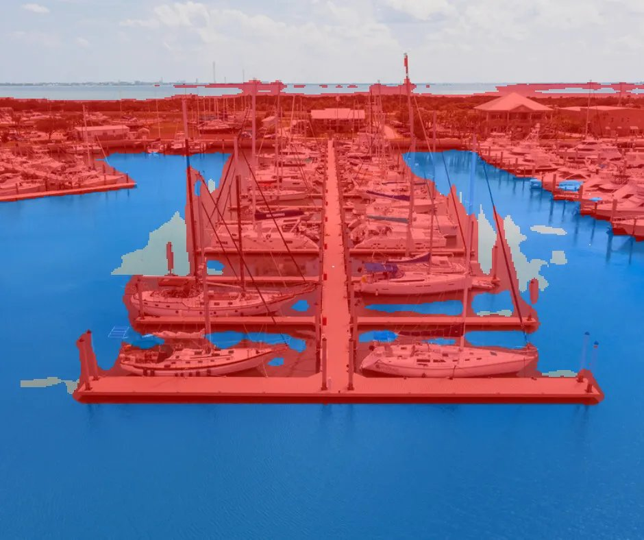
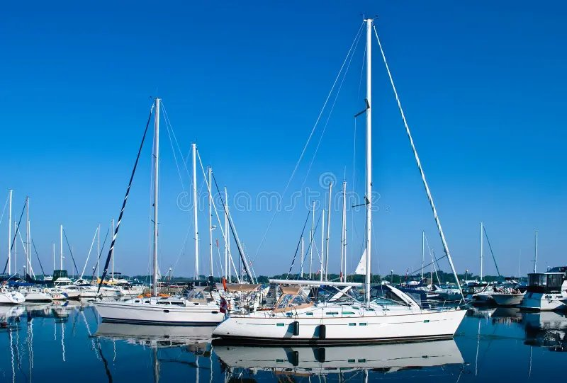
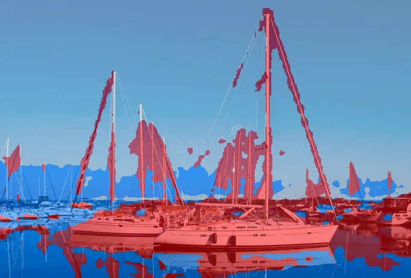
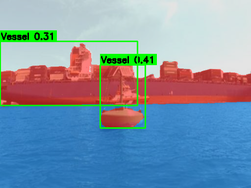

# Maritime Scene Segmentation — Perception MVP
[](https://huggingface.co/spaces/oginjo/maritime-perception)

A semantic segmentation model that classifies maritime scenes into **water**, **sky**, and **obstacles/environment** (vessels, land, shoreline structures) — a foundational building block for maritime perception and autonomy systems (USVs, marine ADAS, situational awareness tools).

Trained on the [MaSTr1325](https://www.vicos.si/resources/mastr1325/) dataset (Bovcon et al., IROS 2019) using a DeepLabV3+ architecture with a pretrained ResNet34 encoder.

## Results

| Class | IoU |
|---|---|
| Obstacle / Environment | 0.974 |
| Water | 0.996 |
| Sky | 0.998 |
| **Mean IoU** | **0.989** |

Trained for 30 epochs on Google Colab (T4 GPU). Full training notebook: [`maritime_segmentation_mvp.ipynb`](./maritime_segmentation_mvp.ipynb).

## What it does

The model takes a maritime scene image and produces a pixel-level overlay showing what it identifies as sky, water, or obstacles — the first stage of a maritime perception pipeline (segmentation → detection → tracking → fusion, as used in systems like ProteusCore or similar marine ADAS perception stacks).

## Generalization testing — where the model breaks, and why

Validation metrics on the held-out MaSTr1325 split are excellent (mIoU 0.989), but **high in-distribution accuracy does not guarantee real-world robustness**. I deliberately tested the model on images visually different from the training distribution to characterize its actual limitations — this is the most informative part of the project.

### Test 1 — Eye-level marina scene (similar style to training data)



**Result: near-perfect.** Water, sky, and vessels (including fine details like flags on masts) are segmented cleanly.

### Test 2 — Aerial / drone shot of a marina

**Original:**



**Segmentation:**



**Result: significant errors.**
- Large open water is correctly classified.
- Sky and background land/trees are misclassified as **obstacle**.
- Small bright/reflective water patches between boat hulls are misclassified as **sky**.

**Why:** MaSTr1325 consists exclusively of eye-level, USV-mounted camera footage, where sky is always a large, dominant region at the top of the frame. From an aerial viewpoint, the sky becomes a thin, distant strip, and small bright water reflections resemble the sky's brightness signature from training — the model has no examples to learn the distinction.

### Test 3 — Eye-level photo, clear cloudless blue sky

**Original:**



**Segmentation:**



**Result: sky misclassified as water.** Vessels and actual water (including reflections) are correctly segmented, but the entire clear blue sky is classified as **water**.

**Why:** MaSTr1325 training images predominantly feature hazy, overcast, whitish-grey skies (typical of low-altitude maritime photography in humid conditions). A clear, saturated blue sky is visually closer to the color of calm water in the training distribution than to the hazy skies the model learned as "sky" — so the model defaults to the more common class with that color signature.

### Pattern across all three tests

| Class | Robustness to distribution shift |
|---|---|
| **Vessels / obstacles** | Consistently accurate across all three tests — the class most critical for collision avoidance is also the most robust |
| **Water** | Reliable for large, continuous regions; fails on edge cases (small reflective patches, unusual camera angles) |
| **Sky** | Least robust class — sensitive to both atmospheric conditions (clear vs. hazy) and camera angle (eye-level vs. aerial) |

## Takeaways

1. **Training data diversity (camera angle, weather, lighting) matters more than raw accuracy metrics.** A model can show mIoU > 0.98 on a held-out split from the same distribution and still fail predictably outside it.
2. **Safety-critical classes degrade more gracefully.** Vessel/obstacle detection — the class that matters most for navigation safety — remained robust across all tested conditions, while the less safety-critical "sky" class was the most brittle.
3. **Next steps to improve generalization:** incorporate training data from multiple camera angles and platforms (aerial/drone in addition to eye-level USV footage), a wider range of atmospheric conditions (clear and hazy skies), and consider domain adaptation techniques rather than relying on a single-source dataset.


## Two-Stage Perception Pipeline

The model can be combined with a YOLO-based vessel detector to form a two-stage maritime perception pipeline — mirroring the "context + characteristic model" architecture used in production maritime autonomy systems:

**Stage 1 — Semantic segmentation** (this model): classifies every pixel as water / sky / obstacle  

**Stage 2 — Vessel detection** (YOLOv8n): detects and localizes vessels within the scene



*Segmentation overlay (red=obstacle, blue=water, grey=sky) with YOLO vessel detection bounding boxes (green). Confidence scores shown per detection. Note: YOLOv8 classifies both the cargo ship and the navigation buoy as vessel — illustrating why a dedicated characteristic classification model is needed as a third stage.*

## Tech stack

- PyTorch + `segmentation_models_pytorch` (DeepLabV3+, ResNet34 backbone, ImageNet pretrained)
- Albumentations for augmentation
- Trained on Google Colab (T4 GPU)
- Gradio for the interactive demo

## Running it yourself

Open [`maritime_segmentation_mvp.ipynb`](./maritime_segmentation_mvp.ipynb) in Google Colab, set the runtime to GPU, and run all cells in order. The notebook downloads the MaSTr1325 dataset automatically, trains the model, and launches an interactive Gradio demo at the end.


## Edge Deployment Benchmark (ONNX)

The model was exported to ONNX format and benchmarked for CPU-only inference — relevant for deployment on resource-constrained maritime edge hardware (ARM64, embedded systems).

| Runtime | Hardware | Latency | FPS |
|---|---|---|---|
| PyTorch | T4 GPU (Colab) | 15.7 ms | 63.8 |
| ONNX Runtime | CPU only (Colab) | 359.9 ms | 2.8 |

**GPU/CPU speedup: 23x**

> Note: CPU benchmark is on a shared Colab instance (not optimized embedded hardware). On dedicated ARM64 edge devices with INT8 quantization, real-world throughput would be significantly higher. For maritime situational awareness applications where scene change is gradual, sub-5 FPS CPU-only inference is often sufficient.

### Exporting to ONNX

```python
torch.onnx.export(model, dummy_input, "maritime_model.onnx", opset_version=18)
```

### Running CPU inference

```python
import onnxruntime as ort
sess = ort.InferenceSession("maritime_model.onnx", providers=["CPUExecutionProvider"])
output = sess.run(None, {"input": image_array})
```

## Dataset citation

```
@inproceedings{bb_iros_2019,
  title={The MaSTr1325 dataset for training deep USV obstacle detection models},
  author={Bovcon, Borja and Muhovič, Jon and Perš, Janez and Kristan, Matej},
  booktitle={2019 IEEE/RSJ International Conference on Intelligent Robots and Systems (IROS)},
  year={2019},
  organization={IEEE}
}
```
